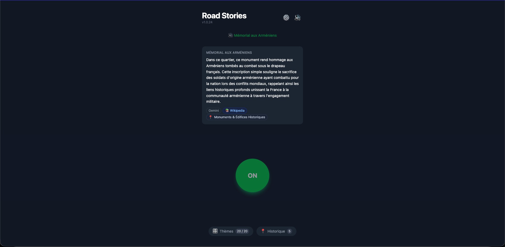
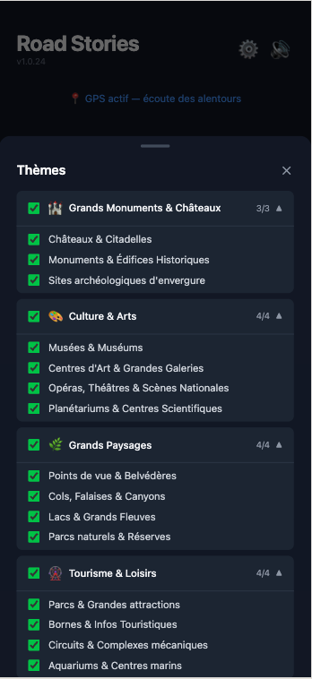
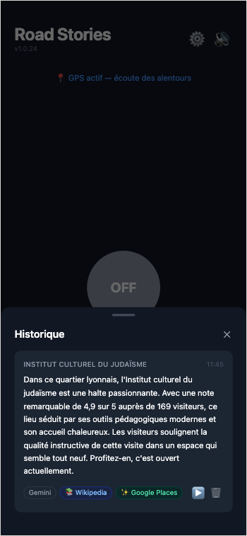
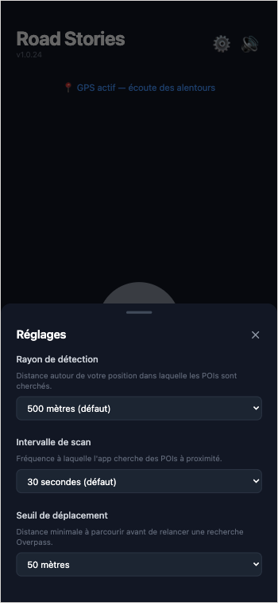
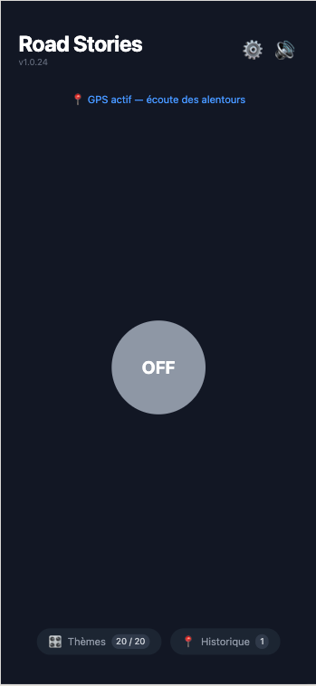

# Road Stories 🚗

PWA mobile qui enrichit vos trajets en voiture en diffusant automatiquement des anecdotes et informations culturelles sur les lieux traversés, grâce à un agent IA propulsé par Gemini.



> Comme un GPS, mais pour la culture.

---

## 📑 Table des matières

- [Présentation](#-présentation)
- [Fonctionnalités principales](#-fonctionnalités-principales)
- [Captures d'écran](#-captures-décran)
- [Aperçu Mobile](#-aperçu-mobile)
- [Thèmes disponibles](#-thèmes-disponibles)
- [Démarrage rapide](#-démarrage-rapide)
- [Configuration](#️-configuration)
- [Stack technique](#-stack-technique)
- [AI Readiness Score](#-ai-readiness-score)
- [Architecture](#-architecture)
- [Limites connues](#-limites-connues)
- [Historique de conception](#-historique-de-conception)
- [Contribution](#-contribution)
- [Licence](#-licence)

---

## 🎯 Présentation

**Road Stories** est une PWA mobile pensée pour les conducteurs (et passagers) souhaitant :

- 🚗 **Enrichir automatiquement leurs trajets** avec des anecdotes culturelles sur les lieux traversés
- 📍 **Détecter les points d'intérêt à proximité** en temps réel via GPS et OpenStreetMap
- 🤖 **Bénéficier d'un agent IA** (Gemini) qui orchestre la recherche d'informations (Wikipedia, Google Places) et génère un message audio naturel
- 🎧 **Écouter sans manipuler** : synthèse vocale automatique, aucune interaction requise pendant la conduite
- 🗂️ **Personnaliser le contenu** via des thèmes et sous-thèmes culturels (patrimoine, nature, gastronomie, anecdotes…)

---

## ✨ Fonctionnalités principales

1. **Mode ON/OFF** : activez l'app avant de partir, tout fonctionne automatiquement ensuite.
2. **Détection automatique** des points d'intérêt à proximité via le GPS (intervalle et rayon configurables).
3. **Panneaux coulissants** :
   - Sélection des thèmes (groupes, sous-thèmes, filtres OSM personnalisés)
   - Historique des lieux visités (réécoute possible)
   - Réglages utilisateur (intervalle de scan, rayon, seuil de déplacement)
4. **Pause/reprise automatique de la musique** lors de la lecture d'un message.
5. **Synthèse vocale** (~30 secondes max, voix navigateur, non interruptible).
6. **Badges d'outils IA** : Gemini, Wikipedia, Google Places (affichés sur chaque anecdote).
7. **Cache Overpass intelligent** : évite les requêtes redondantes et optimise la consommation réseau.
8. **Filtrage avancé des POI** : exclusion automatique des panneaux administratifs, lieux sans contexte, etc.
9. **Historique** : tous les POI déclenchés sont listés, avec possibilité de réécouter le message ou de supprimer une entrée.
10. **Centralisation des types et logique métier** : code maintenable, typé, et facilement extensible.

> Aucune interaction nécessaire pendant le trajet : tout est pensé pour la conduite.

---

## 📸 Captures d'écran

<p align="center">
  
  
  
</p>

---

## 📱 Aperçu Mobile

L'application est entièrement responsive et conçue comme une PWA (Progressive Web App) installable.

<p align="center">
  
</p>

---

## 🗺️ Thèmes disponibles

L'utilisateur choisit les thèmes et sous-thèmes qui l'intéressent, organisés en groupes :

- 🏰 **Patrimoine** (châteaux, monuments, sites archéologiques, curiosités géologiques…)
- 🎨 **Culture & Arts** (musées, œuvres, théâtres…)
- 🌿 **Nature** (sites naturels, parcs, curiosités…)
- 🍽️ **Gastronomie locale**
- 👤 **Personnages célèbres**
- 💡 **Anecdotes insolites**

Chaque sous-thème correspond à des filtres OSM précis, modifiables facilement dans le code.

---

## 🚀 Démarrage rapide

### Installation locale

```bash
# Cloner le repository
git clone https://github.com/GuillaumeBraillon/road-stories.git
cd road-stories

# Installer les dépendances
npm install

# Configurer les variables d'environnement
cp .env.example .env.local
# Éditez .env.local avec vos clés API

# Lancer en développement
npm run dev
```

L'application sera accessible sur `http://localhost:5173`

### Développement avec les fonctions Edge (Vercel)

Pour tester les proxys API (Gemini, Overpass, Google Places) en local :

```bash
npm run dev:vercel
```

---

## 🛠️ Configuration

### Variables d'environnement

Copiez le template fourni puis complétez-le :

```bash
cp .env.example .env.local
```

```env
VITE_GEMINI_API_KEY=YOUR_API_KEY_HERE
GEMINI_API_KEY=YOUR_API_KEY_HERE

VITE_GOOGLE_PLACES_API_KEY=YOUR_API_KEY_HERE
GOOGLE_PLACES_API_KEY=YOUR_API_KEY_HERE
```

- Les variables préfixées `VITE_` sont utilisées en dev local (`npm run dev`) par les services client.
- Les variables sans préfixe (`GEMINI_API_KEY`, `GOOGLE_PLACES_API_KEY`) sont celles lues par les fonctions Edge (`api/`) en production sur Vercel.

**Obtention des clés** :

1. **Gemini** : créez une clé sur [Google AI Studio](https://aistudio.google.com) (free tier disponible)
2. **Google Places** : créez une clé sur [Google Cloud Console](https://console.cloud.google.com) en activant l'API Places (New)

> ℹ️ En production (Vercel), les clés restent **côté serveur** : toutes les requêtes IA et Google Places passent par les fonctions Edge du dossier `api/`, jamais directement depuis le client.

### Prérequis

- Node.js 20+
- Une clé API Google AI Studio (Gemini)
- Une clé API Google Places

---

## 🔧 Stack technique

### Frontend

- **React 19** : Framework UI moderne avec Hooks
- **TypeScript** : Typage strict pour robustesse maximale
- **Vite** : Build tool ultra-rapide
- **Tailwind CSS v4** : Design system utilitaire
- **Lucide React** : Bibliothèque d'icônes modernes

### IA & Sources de données

- **Gemini** (`@google/genai`) : agent IA avec tool use pour la génération de messages culturels
- **OpenStreetMap / Overpass API** : détection des points d'intérêt
- **Wikipedia REST API** : contenu encyclopédique
- **Google Places API** : détails enrichis des lieux (notes, horaires, avis)

### APIs navigateur

- **Web Speech API** : synthèse vocale
- **Geolocation API** : suivi GPS en temps réel
- **Wake Lock API** : maintien de l'écran actif pendant le trajet

### Hébergement & Infrastructure

- **Vercel** : hébergement + fonctions Edge (proxys API sécurisés)
- **Edge Runtime** : compatibilité stricte (aucune dépendance Node native côté `api/`)

### Outils de développement

- **ESLint** : Linter JavaScript/TypeScript
- **Prettier** : Formatage de code
- **TypeScript strict** : `tsc --noEmit` en CI locale

---

## 🤖 AI Readiness Score

**Score global : 8.5/10**

### 📊 Détail de l'évaluation

- 🧱 Structuration des données (LLM-ready) : 9/10
- 🧩 Séparation des responsabilités : 9/10
- 🔌 Compatibilité API / tool calling : 9/10
- 🤖 Intégration IA native actuelle : 8.5/10
- 📚 Extensibilité vers RAG / agents : 7.5/10

### 🎯 Conclusion

Road Stories est **construit autour d'un agent IA dès l'origine** (et non ajouté a posteriori) : le tool use Gemini orchestre déjà dynamiquement plusieurs sources externes (Overpass, Wikipedia, Google Places) via un dossier `api/tools/` dédié, avec déclarations JSON et handlers d'exécution strictement séparés. L'architecture Edge-first et le typage strict en font une base solide pour évoluer vers un agent multi-outils plus avancé (ajout de nouvelles sources, mémoire contextuelle, personnalisation par utilisateur).

---

## 🏗️ Architecture

### Composants UI (`src/components/`)

Composants React purs, découplés de toute logique métier (qui réside dans les hooks/services).

```
components/
├── ToggleButton.tsx      # Bouton ON/OFF principal
├── StatusIndicator.tsx   # Indicateur d'état (idle, actif, speaking)
├── ThemeSelector.tsx     # Sélecteur de thèmes culturels
├── ThemePanel.tsx        # Panneau latéral de gestion des thèmes
├── HistoryPanel.tsx      # Panneau d'historique des messages entendus
├── SettingsPanel.tsx     # Panneau de réglages utilisateur
├── BottomSheet.tsx       # Composant feuille/bas d'écran (mobile)
├── ToolBadges.tsx        # Badges d'outils utilisés (Wikipedia, Places…)
└── TppmThemes.tsx        # Badge de thème réutilisable
```

### Hooks métier (`src/hooks/`)

```
hooks/
├── useRoadStories.ts     # Hub d'orchestration principal (statut, workflow, triggers)
├── useGeolocation.ts     # Surveillance GPS (écoute, erreurs, position)
├── useOverpassCache.ts   # Cache POI Overpass (anti-doublon, intervalle)
├── usePoiFilter.ts       # Filtrage dynamique des POI selon les thèmes
├── usePoiHistory.ts      # Historique des POI entendus
└── usePWAInstall.ts      # Installation PWA (bannière, prompt)
```

### Services client (`src/services/`)

```
services/
├── gemini.ts             # Orchestration principale Gemini
├── overpass.ts           # Requêtes Overpass (OpenStreetMap), parsing POI
├── wikipedia.ts          # Appel Wikipedia REST API
├── places.ts             # Appel Google Places, formatage prix/avis
├── tts.ts                # Synthèse vocale Web Speech API
├── prompts.ts            # Génération des prompts système/utilisateur
├── storage.ts            # Stockage local (historique, thèmes, réglages)
├── poiFilter.ts          # Helpers de filtrage POI
└── logger.ts             # Logger centralisé (dev only)
```

### Fonctions Edge & Orchestration IA (`api/`)

Fonctions serverless Vercel qui centralisent la logique serveur : proxy des services tiers (contournement CORS) et orchestration de l'agent Gemini. Aucune dépendance Node native — compatibilité Edge Runtime stricte.

```
api/
├── gemini.ts             # Handler principal : tool use, prompt, orchestration IA
├── overpass.ts           # Proxy POST vers Overpass API
├── places.ts             # Proxy vers Google Places API
└── tools/
    ├── wikipedia.ts       # Tool Gemini : résumé Wikipedia d'un lieu
    ├── places.ts          # Tool Gemini : détails Google Places d'un lieu
    └── index.ts           # Point d'entrée agrégeant les tools pour Gemini
```

### Concept clé : l'agent IA en tool use

Gemini ne se contente pas de générer du texte : il **décide lui-même** quels outils appeler (Wikipedia, Google Places) selon le contexte du lieu, via le mécanisme de tool use natif de l'API Gemini.

```typescript
// api/tools/index.ts — déclaration + exécution des outils exposés à l'agent
export const toolDeclarations = [wikipediaTool.declaration, placesTool.declaration];

export async function executeTool(name: string, args: Record<string, unknown>) {
  // Route l'appel de l'agent vers le bon module et retourne le résultat
}
```

---

## ⚠️ Limites connues

- Couverture OSM variable selon les régions
- Voix synthétique dépendante du navigateur (Web Speech API)
- Mode arrière-plan limité sur iOS (contrainte PWA Safari)
- Les réglages sont conservés localement (pas de cloud sync)
- L'IA peut parfois manquer de contexte sur certains lieux très locaux

---

## 🤖 Historique de conception

**Développement assisté par IA, environnement VS Code**

- **GitHub Copilot Pro (VS Code)** : assistance principale au développement, avec sélection de modèles selon les besoins et les coûts : GPT-5.3-Codex, Claude Sonnet 4.6, Gemini 3 Flash, GPT-5.4, GPT-5.4 mini, GPT-5 mini
- **OpenAI Codex (VS Code)** : utilisation avec GPT-5.5 via forfait gratuit pour génération et refactorisation de code
- **Claude (Anthropic)** : utilisation de Sonnet 4.6 via forfait gratuit pour raisonnement, architecture et refactorisation complexe
- **Gemini (Google)** : utilisation de Gemini 3.5 Flash et 3.1 Pro via forfait gratuit pour assistance alternative et vérification de solutions

Cette approche hybride combine plusieurs environnements IA afin d'optimiser la qualité du code, la rapidité de développement et la diversité des suggestions.

---

## 🤝 Contribution

### Conventions de code

- **TypeScript strict** : aucun `any` toléré
- **Séparation stricte des responsabilités** : composants UI purs / hooks réactifs / services métier
- **Edge Runtime uniquement** côté `api/` : aucune dépendance Node native
- **Documentation JSDoc systématique**

### Git Workflow

```bash
# Créer une branche feature
git checkout -b feature/nouvelle-fonction

# Commiter avec message descriptif
git commit -m "feat(themes): Ajouter un nouveau thème culturel"

# Pusher et ouvrir une Pull Request
git push -u origin feature/nouvelle-fonction
```

### Tests

```bash
# Vérification des types
npm run tsc

# Lint
npm run lint:fix

# Build de production
npm run build
npm run preview
```

### Documentation

- **[CHANGELOG.md](./CHANGELOG.md)** : historique complet des versions
- **[.github/copilot-instructions.md](./.github/copilot-instructions.md)** : guide complet pour développeurs
- READMEs par dossier : [`src/components`](./src/components/README.md), [`src/hooks`](./src/hooks/README.md), [`src/services`](./src/services/README.md), [`api`](./api/README.md), [`api/tools`](./api/tools/README.md)

---

## 🔭 Améliorations envisagées

Pistes identifiées pour renforcer la couche IA de l'application, notamment vers un agent plus autonome et contextuel :

- **Recherche sémantique** : introduire de l'embedding sur les POI/thèmes pour dépasser le filtrage par règles OSM et permettre une similarité sémantique entre lieux ou anecdotes.
- **Mémoire persistante** : faire évoluer l'historique local vers un store consultable par l'agent, capable de reconnaître un lieu déjà visité et d'adapter son discours en conséquence.
- **Contexte multi-tours** : passer d'un agent mono-tour (un POI = un appel isolé) à une orchestration capable de raisonner sur plusieurs POI/trajets successifs.
- **Base de connaissances propre** : mettre en cache et indexer le contenu récupéré (Wikipedia, Places) plutôt que de tout requêter à la volée, pour réduire la latence et enrichir progressivement les réponses.
- **Nouveaux outils Gemini** : exploiter la structure modulaire de `api/tools/` pour ajouter facilement de nouvelles sources (météo, événements locaux, Wikidata…).

---

## 📚 Licence

MIT

---

**Fait avec ❤️ pour rendre chaque trajet un peu plus culturel**
